---

id: nectar-advanced-networking
summary: Advanced networking
categories: nectar
tags: networking, private, router, floating, ip address
difficulty: 5
status: draft
feedback_url: https://github.com/JustBerkhout/tutorials.ubuntu.com/issues
published: 2019-05-20
author: Just Berkhout <just.berkhout@utas.edu.au>

---


# Advanced networking

## Overview

Duration: 3:00

In the past, compute instances on the Nectar Research cloud were limited to a single network configuration referred to as Classic Networking. Each compute instance was attached to the public internet via a single network interface and assigned a fixed publicly routable IP address. Compute instances in the QRIScloud availability zone had an additional non-routed network interface (qld-data network) for communicating with RDS storage.

With the introduction of Advanced Networking, users of the Nectar Research Cloud now have the ability to create private networks within their respective projects (subject to quota allowance). Private networks are completely isolated and are unique to the project in which they are created. Each private network can span supporting sites across the Nectar Research Cloud, meaning that compute instances from multiple availability zones can be connected together over a private link; mitigating the need for network traffic to travel over the public internet. Advanced Networking also allows the use of Floating IP addresses. Floating IP addresses are IP addresses dedicated to a project (subject to quota allowance) and can be attached to an instance that is part of a private network in order to create a public presence for that instance. Because Floating IP addresses are dedicated to a project, it makes it possible to maintain a public IP address for an instance after termination. Each private network can contain multiple private subnets. Networks can be created and manipulated using the Network submenu from the Nectar dashboard or using the python OpenStack client.

Instances belonging to a project with a private network can have a network interface created and attached to that private network and assigned a private IP address from a network subnet. Multiple network interfaces can be attached to a single instance. While these interfaces can be a mix of classic networking and private network interfaces, it is recommended that only one routed network is attached to an instance.

### What you'll learn

- Create a Private Network
- Create a Router
- Obtain, attach and re-attach floating IP-Addresses

### What you'll need

- Understanding of networking and routing
- Access to a Nectar Project with an allocation for Networks, Routers and Floating IP-addresses
- Access to- and understanding of the `openstack` and `neutron` CLI interfaces.

## Availability and quota

Duration: 3:00

Advanced Networking is available in a number of Nectar Availability Zones. Before you can use private networking you'll need to have quota in place for *Private Networks*, *Routers* and *floating IP Addresses*
### Availability

Advanced networking is available at the following sites:

- Melbourne
- QRIScloud
- Tasmania
- Auckland

### Requesting Quota

To request private networking / floating IP resources, please ask for an amendment to your allocation and fill in the "Advanced Networking" section.

Note:

1. If you want to just implement a private network for your instances, you need to request quotas for a private network *and* a router.
2. If you want to use floating IPs, you need to request quotas for each floating IP *and also* for at least one private network *and* one router.

You can confirm your floating IP quota in the Project -> Overview section of the Dashboard:

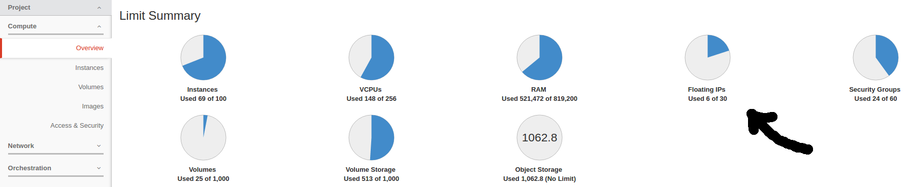

You can confirm your current network quotas by running the following command using the Python Neutron CLI:

```bash
neutron quota-show
+---------------------+-------+
| Field               | Value |
+---------------------+-------+
| floatingip          | 30    |
| network             | 20    |
| port                | -1    |
| rbac_policy         | 10    |
| router              | 20    |
| security_group      | 60    |
| security_group_rule | 300   |
| subnet              | 50    |
| subnetpool          | 0     |
+---------------------+-------+
```

note: -1 denotes unlimited

## Networking Concepts

Duration: 8:00

To make use of Advanced Networking you should be at least familiar the Networking concepts listed below.

[IPv4 Address](https://en.wikipedia.org/wiki/IP_address) - A 32 bit number that represents a computer connected to a network, such as the public internet or a private local network. IPv4 addresses usually displayed in human readable format as 4 numbers between 0-255 separated by a dot.

positive

: *Example 1*: `192.168.0.1`

[Subnet](https://en.wikipedia.org/wiki/Subnetwork) - A logical subdivision of a network. A subnet contains a certain amount of IP addresses depending on its size (IP addresses ending in 0 and 255 are reserved). Computers in the same subnet do not need to use a router to communicate. Think of subnets as streets - each street has a set of houses (IPv4 addresses) belonging to it. On the public internet, street names are unique however in private networks they are not. In fact, there are 3 subnets that are reserved specifically for use in private networks, and NeCTAR strongly encourages using those subnets when creating Private Networks. Subnets can be expressed using a network address and a subnet mask or using CIDR notation.

positive
: *Example 2:* `192.168.100.0,255.255.255.0` is a subnet expressed using a network address and a subnet mask. This subnet contains the following usable IP addresses: `192.168.100.1` -> `192.168.100.254`

positive
: *Example 3:* `192.168.100.0/24` is a subnet equivalent to Example 2, expressed using CIDR notation. CIDR notation uses a slightly different way to define the subnet mask. `255.255.255.0` converted to binary is `11111111.11111111.11111111.00000000` and 24 simply dictates the numbers of 1's on the left.

positive
: *Example 4:* `10.0.0.0/8`, `172.16.0.0/12` and `192.168.0.0/16` are subnets reserved for use in private networks containing 16777214, 1048574 and 65,534 usable IP addresses respectively.

[Router](https://en.wikipedia.org/wiki/Router_(computing)) - A device that routes network traffic between subnets so that machines on different subnets are able to communicate. Routers generally do this by doing lookups in the router's routing table.

[Routing table](https://en.wikipedia.org/wiki/Routing_table) - A list stored on a computer or a routing device that contains routes which the computer or routing device is aware of.

Route - a rule which contains the next routing device to send a packet to so that it gets forwarded to its destination outside of the local subnet. Routes are specified based on destination network. In OpenStack Private Networks, "Route", "Static Route" and "Host Route" are used interchangeably.

[Gateway (Default Route)](https://en.wikipedia.org/wiki/Default_gateway)- a route which is taken by default if the routing table does not contain a route for a particular destination. This is the "else clause" of routing.

[NAT (Network Address Translation)](https://en.wikipedia.org/wiki/Network_address_translation) - a method of remapping a source or destination address in a network packet to a different address as the packet passes through a router. NAT allows multiple computers on a private network to simultaneously communicate with computers on the internet. NAT is commonly a feature of routers.

[Network Interface (Port)](https://en.wikipedia.org/wiki/Port_(computer_networking)) - point of interconnection between a computer and a network. Interfaces can be physical: in the form of a computer network card; or virtual: in the form of a connection between an instance and a virtual OpenStack router.

[DNS (Domain Name System)](https://en.wikipedia.org/wiki/Domain_Name_System) - A protocol for translating domains into IP addresses.

positive
: For example, [www.nectar.org.au](http://www.nectar.org.au/) is translated to `180.235.129.121` by a DNS Server.

[DNS Server (Name Server)](https://en.wikipedia.org/wiki/Name_server) - A service which utilises the DNS protocol to translate domains into IP addresses.

positive
: There are many free public DNS servers, such as `8.8.8.8` and `8.8.4.4`.

[DHCP (Dynamic Host Configuration Protocol)](https://en.wikipedia.org/wiki/Dynamic_Host_Configuration_Protocol) -  a protocol for dynamically assigning IP addresses and routing information on a subnet. If a DHCP service is not present on a subnet, then an IP address and a subnet has to be manually set on each computer (static IP). If a DHCP service is present on a subnet, then the DHCP server decides what IP address (dynamic IP) to distribute to computers as they join the network. A DHCP allocation pool is a range of IP addresses that can be distributed to computers on the network.

[Private Network](https://en.wikipedia.org/wiki/Private_network) - A private subnet or subnets that are commonly used in local area networks. A private subnet is only able to communicate with public subnets via a router that performs source Source NAT (SNAT). Typically, the router replaces the private source IP address with the address of the router, however, in the case of an OpenStack floating IP the private address is replaced with either the floating IP address, or if no floating IP is attached, the address of the external network attached to the virtual router.

[Network Packet](https://en.wikipedia.org/wiki/Network_packet) - A formatted unit of data sent over the Internet. Communication between computers is achieved by sending/receiving one or more packets.


## Classic vs. Advanced Networking

Duration: 3:00

### Classic Networking:

Compute instances are assigned a fixed IP address and are connected directly to the internet via a public network located at the instance’s availability zone.
 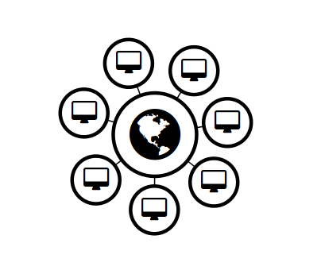


### Advanced Networking

Compute instances are attached to a private network that is attached to a virtual router. The router is connected to the internet via a public IP address. Internet traffic can flow from the private network through the router to the public internet.

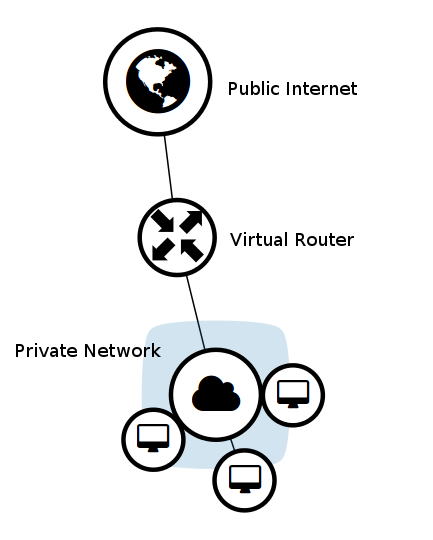

## Demonstration

Duration: 8:00

A video demonstration of the steps to create a *private network*, a *router* and attach a *floating ip address* is here

[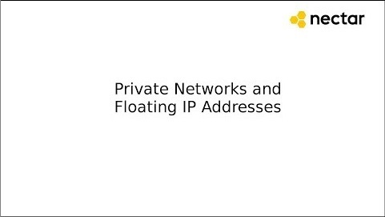](https://youtu.be/mQP07VmKmwg)


## Create network

Duration: 6:00


Below is a practical example of creating a private network, a private subnet within the private network, a virtual router, attaching the virtual router to the private network and the external network, then launching an instance with private network configuration, attaching a floating IP to the instance and configuring the network within the instance.

Step 1. Create a Private Network:

Step 1a. Once you have been granted a network quota allocation, select the desired project from the Nectar dashboard and navigate to the **Network** -> **Networks** tab:

 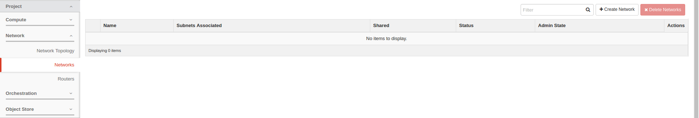

Step 1b. Click the **Create Network** button.

Step 1c. From the Create Network window enter a name for your private network, and click **Next**:

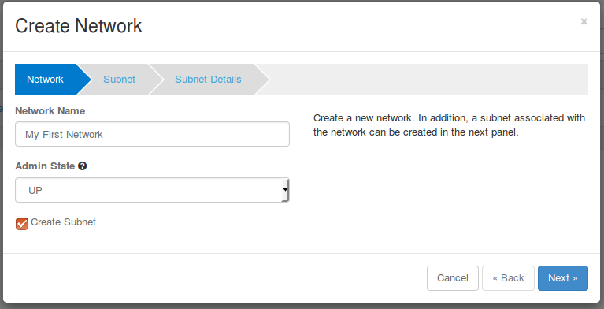

Step 2. Create a Subnet within a Network:

Subnets specify IP ranges that can be used within this network.

Step 2a. From the Subnet tab complete the following fields and click **Next**:

- Subnet Name
- The Network Address specified in CIDR notation
- Set the gateway IP as the first address in your network (or leave blank and this will be done automatically). Gateway needs to be enabled if your instance relies on the OpenStack metadata service to bootstrap or operate (all NeCTAR Official Images do), or if you require communication to devices outside of this subnets (eg the Internet). If you disable the gateway, the next tab Subnet Details will not be available. The instance operating system will simply not get the 0.0.0.0/0 default route if gateway is disabled. You can always change your mind later by clicking on your private network, then clicking **Edit Subnet** next to the subnet which you wish to change Gateway settings for.

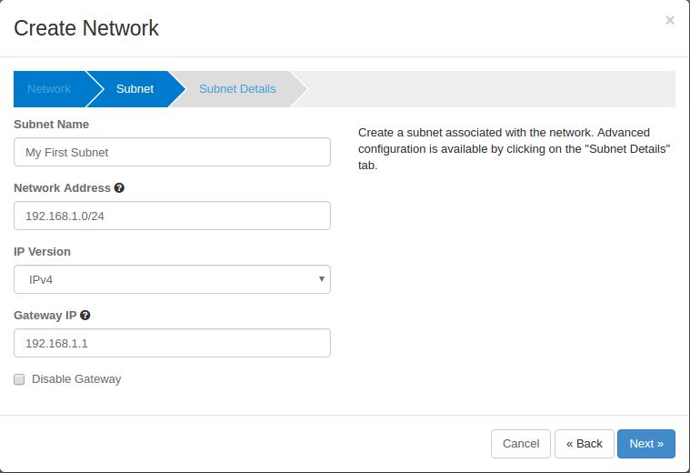

You can refer to the **Network -> Network Topology** tab for a visual representation:

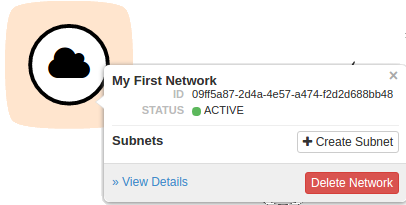

Step 2b. From the Subnet Detail tab complete the following fields and click **Create**:

- Tick "Enable DHCP"
- Allocation Pools
- DNS Name Servers

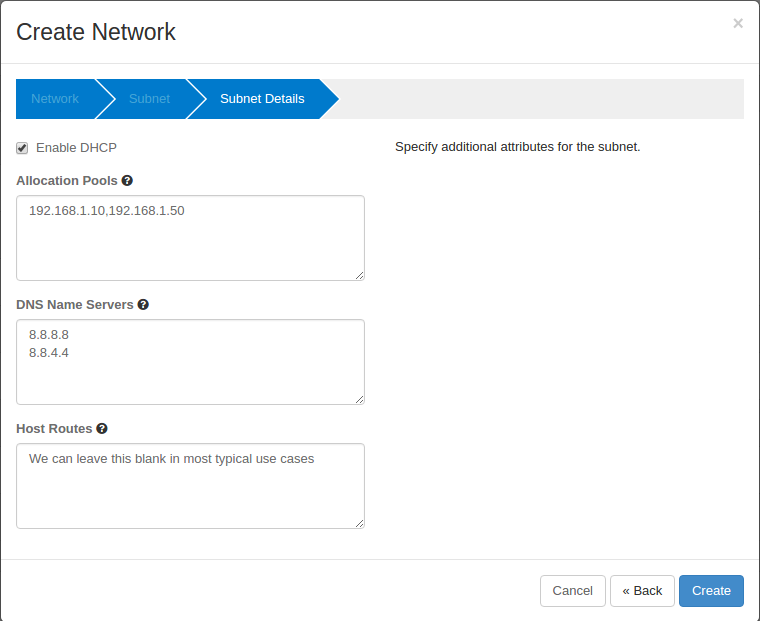

You can refer to the **Network -> Network Topology** tab for a visual representation:

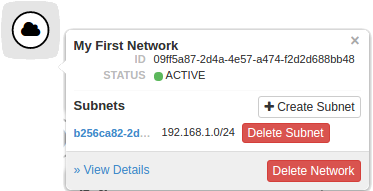


## Create a router

Duration: 6:00


Step 3. Create a Router:

Advanced Networking supports the creation of virtual routers that enable network traffic to be directed outside of the private network. Routers can be attached to an external network. When attached to an external network, the router can provide attached private networks with public internet access via [SNAT](https://en.wikipedia.org/wiki/Network_address_translation). In this way, multiple VMs can use the same IP address to communicate with the outside world, saving precious public IP resources.

A router is required for the OpenStack metadata service (169.254.169.254) to function (which is used to inject public keys into instances). Without a functioning metadata service, the instance cannot determine its own hostname, ssh public keys etc.

When you create a router, the DHCP service starts advertising a default route to your instances when you join to the private network - this is your gateway to the Internet (provided you join your router to an external network), or it can be a router to direct traffic to and from other subnets you create inside your private network. Similarly if you use Classic Networking, a default route to the Classic Networking router is advertised to your instance. The Classic Networking router is already configured by Nectar Administrators and users are not able to alter its behavior. It is not a good idea to mix Classic Networking and Advanced networking because having two default routes will break communications to the instance. If you have accidentally mixed Classic and Private networks and you are having trouble communicating with your instance, you can always remove one by detaching the appropriate interface from the instance using the Instance Actions dropdown menu, then rebooting the instance. If you are launching in QRIScloud availability zone, and require the qld-data network for communicating with RDS storage, and you want to remove Classic Networking, simply detach ONLY the public interface and reboot the instance.

Please note that creating a router and attaching it to an external network does not necessarily provide a way into the instance from the internet, only a way out. If you want to create a way into the instance, we recommend using floating IP's (subject to quota allowance), as instructed below.

Step 3a. Select the desired project from the Nectar dashboard and navigate to the **Network** -> **Routers** tab:

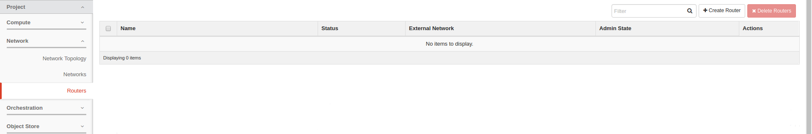

Step 3b. Click the **Create Router** button.

Step 3c. From the Create Router window enter the name of your router. Select an external network local to your instance Availability Zone to achieve the best network performance. This will attach a publicly routed IP (not to be confused with Floating IP) to your router and allow outbound communication from any instance that joins your gateway-enabled private subnets. Once completed, click **Create Router**:

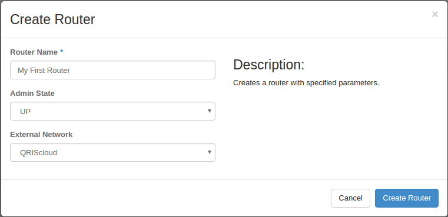

You can refer to the **Network -> Network Topology** tab for a visual representation:

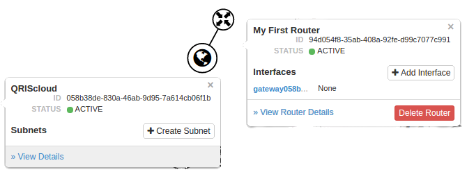

Once the router has been created you must attach it to the private network of choice.

Step 4. Attach a Router to a Private Network:

Step 4a. From the Routers menu, click the name of your router, then select the Interfaces tab.

Step 4b. From within the Interfaces tab click **Add interface****:**

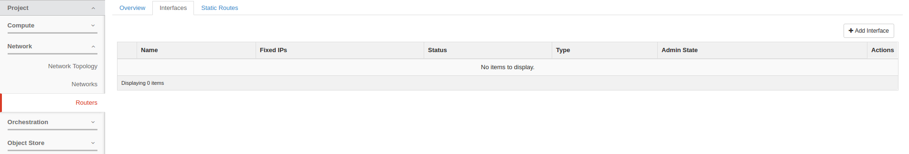

Step 4c. From the Add Interface window, select the Subnet you created earlier from the drop down box. Ensure you set the IP Address (optional) to the IP address you specified in Creating a Private Network, Step 4, Gateway IP. Once completed, click **Add interface**:

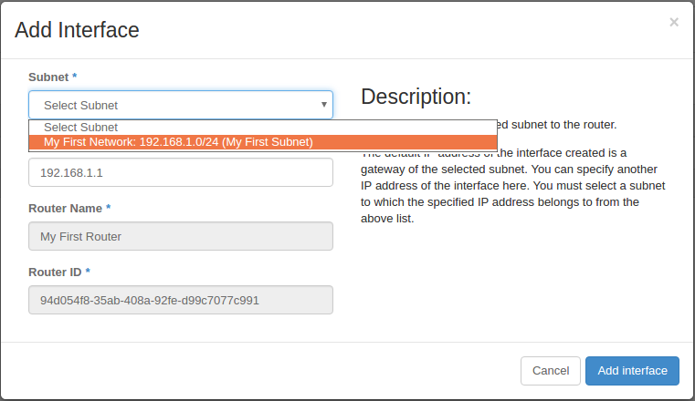

You can refer to the **Network -> Network Topology** tab for a visual representation:

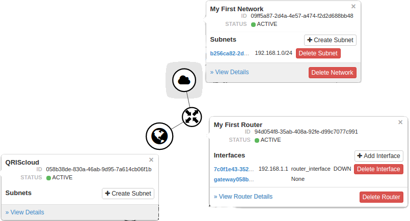

Once the interface has been successfully created you can begin to attach a compute instance to the network.


## Launch instance in your new network

Duration: 6:00

Step 5. Attach a private network to a new instance:

In order for a compute instance to communicate on a private network it must be attached to an interface on that network. This section describes attaching a private network to an instance at instance launch time. If you already have a running instance, please see Section: Making Changes, Heading: Attaching network interface to existing compute instance.

Step 5a. From within the Launch Instance window in the dashboard select the Networking tab. Add your Private Network to Selected Networks using the + or - buttons or by dragging and dropping. We will remove the Classic Provider network in this example as we intend to use floating IP's for inbound communications and we do not require the qld-data network for communicating with RDS storage:

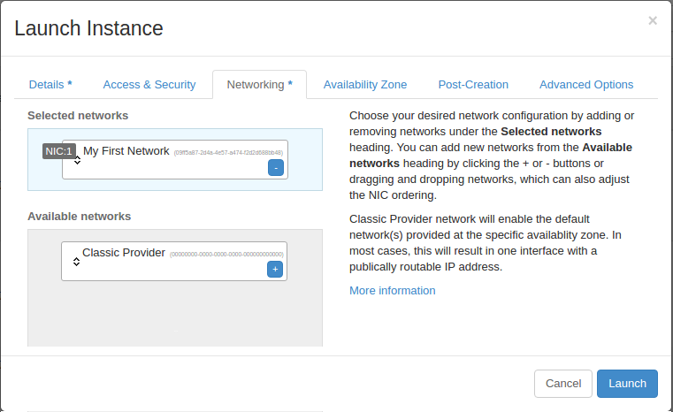

Step 5b. In the Availability Zone tab, ensure you select the Availability Zone that is local to the external network to which you connected your router:

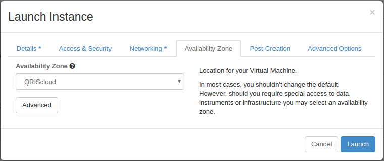

If you use the OpenStack CLI, you can use the `--nic net-id=<NETWORK_ID>` flag when launching. For example:

```bash
openstack network list #Find the network UUID which we want to use when launching new instance

+--------------------------------------+-----------------------------------+----------------------------------------------------------------------------+
| ID                                   | Name                              | Subnets                                                                    |
+--------------------------------------+-----------------------------------+----------------------------------------------------------------------------+
| 00000000-0000-0000-0000-000000000000 | Classic Provider                  |                                                                            |
| 24dbaea8-c8ab-43dc-ba5c-0babc141c20e | tasmania                          | cf44c9ed-9e8b-47d8-bbc9-847801f1b3ca                                       |
| 058b38de-830a-46ab-9d95-7a614cb06f1b | QRIScloud                         | 24f7fa26-8f43-4b65-9bdf-91f99b5ae9fe                                       |
| e48bdd06-cc3e-46e1-b7ea-64af43c74ef8 | melbourne                         | b4771a97-bfb8-4e48-89af-10cf88e63a7f                                       |
| 00691b0f-69c3-444b-85ea-262dd6909052 | qld-data                          | 5783e74d-6e00-4815-a9c8-c0c54cdcf9fa                                       |
| 7b90b4df-5e64-4e50-8abd-1e1339f092fa | qh2-uom                           | 21a2e78b-483b-48a8-9bd9-770ea196acfd, d81ce7b8-c9d5-4385-b2bf-d620c59fe76f |
| 96d5e661-cdb6-4ecf-9a38-b0edda961fad | noblepark                         | fcd0ed12-d7c2-43d7-b9bd-556260072361                                       |
| e93c9d65-878a-4760-9111-c73f79115161 | queensberry                       | 25347767-e846-4e35-b60e-28931b5bdc7b, 9e354233-41b6-4437-98b1-5c4ab49d2a8a |
| 56c84852-e8b1-49f7-be67-bc0cfaec4188 | intersect-02                      | 67ab51f2-d046-42b1-9197-2b1d8ed2c5a7                                       |
| 9a284788-c0dd-4c5d-bc45-4425ad078737 | nci                               | b7e9dffe-6009-4e53-a550-5b2c19a2ac79                                       |
| e3573b3f-db78-4ab9-938f-542f7c94d0a0 | pawsey-01                         | 6af9d7da-6d48-4f6b-a255-0bd6d903ed6a                                       |
| 283e92a3-40dc-482f-bb94-9f4632c0190b | qld                               | 700efd32-2c0a-4292-a0d9-a83a1bb6fa52                                       |
| 915a3d96-693d-4c9d-a2ef-04996ab085d3 | monash-02                         | 2bdd914a-6e5f-4f34-ae19-f881be8be295                                       |
| 78dacb06-1162-454d-850c-78afd2033a38 | monash-03-internal                | 72b4520a-9e68-4b50-8e83-bb14f3443c63                                       |
| eb33feb8-027d-4d5d-8eab-69d3d6c08666 | intersect-01                      | 05341f20-ae8b-4670-9df7-171aada556db                                       |
| c9cbd99b-b6b3-49b9-b2b3-108dde0cdda6 | monash-01                         | 91bf744e-b79a-4bc5-8722-fe3569add0c0                                       |
| f0c86d08-d45b-45c4-9216-b8abd6bc133c | qh2-uom-internal                  | bc63c260-b2f6-4d57-ba03-f8fd89a35d8f                                       |
| 09ff5a87-2d4a-4e57-a474-f2d2d688bb48 | My First Network                  | 3b27e01c-d69d-4ae6-be9e-c3b61ce93b93                                       |
| 8c6b8b1f-2610-4b26-9b27-cd6db8aca397 | tas                               | 9df63d68-7a3e-4ef8-9d6b-67ae4b74c509                                       |
| 71a08d91-ea37-4e2a-834e-0b158f08a351 | tas-s                             | dc38a998-57f9-49c0-8ee3-2681afedfbd2                                       |
| bda5ae9f-e56c-43b5-a327-a81672247436 | as-tn                             | 24b0228b-341d-4ece-8450-183627affb8e                                       |
| b2719045-2cd1-4290-9ca8-9055b9df9df4 | sa-citywest                       | 03292ee8-0ae4-4d18-9c8c-708c9ecdeb09                                       |
| cba46835-45b7-43c0-a616-365302c3a634 | asm-priv-test                     | 284f4ea3-c4e9-4951-8cf1-8651a3fdc8aa                                       |
| 4d0fbec6-f9a4-4d39-9225-082716c64008 | monash-03-public                  | 8bb4e24c-538d-4604-9128-b7aab6afaaa7                                       |
+--------------------------------------+-----------------------------------+----------------------------------------------------------------------------+

openstack server create \
--flavor m2.small \
--image c8663e68-921c-4e0a-9048-d9e042a4b41f \
--key-name dl-desktop \
--security-group ssh_icmp_http_https \
--availability-zone QRIScloud \
--nic net-id=00000000-0000-0000-0000-000000000000 --nic net-id=09ff5a87-2d4a-4e57-a474-
f2d2d688bb48 \
test-instance-classic-and-private-net
```

You can refer to the **Network -> Network Topology** tab for a visual representation:

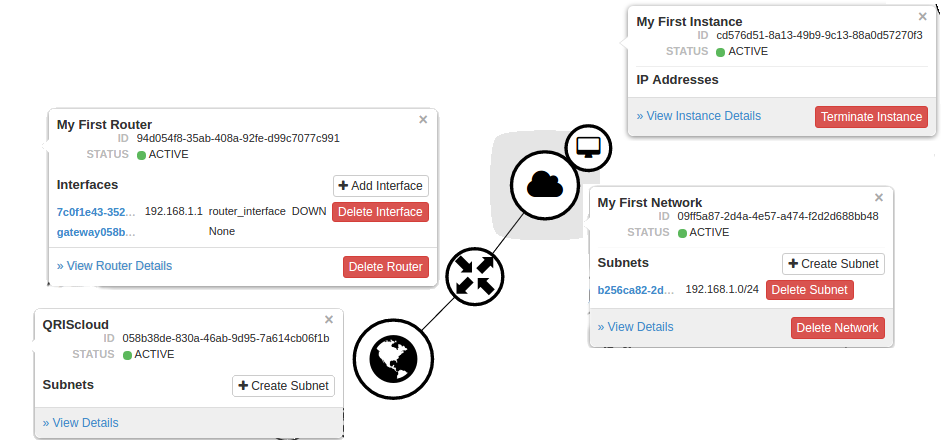


## Attach floating IP

Duration: 4:00

Step 6. Attaching a floating IP to an instance:

In order for a floating IP to be attached to your instance properly, your instance needs to be part of a private network, which contains a private gateway-enabled subnet. You also need to have a router connected to an external network and your private network.

Step 6a. From the instance Actions menu click Associate Floating IP:

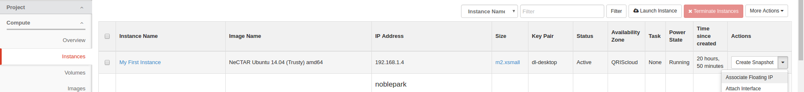

Step 6b. Select a floating IP address from the list and ensure your instance port is selected in the "Port to be associated" field. If you see "No floating IP addresses allocated", click the + (plus) icon, which will take you to a new window where you can allocate a floating IP address from a pool belonging to an Availability Zone. This is an extra step required to complete after floating IP quota is granted. Please allocate a floating IP from the same Availability Zone as your instance. When finished, click **Associate**:

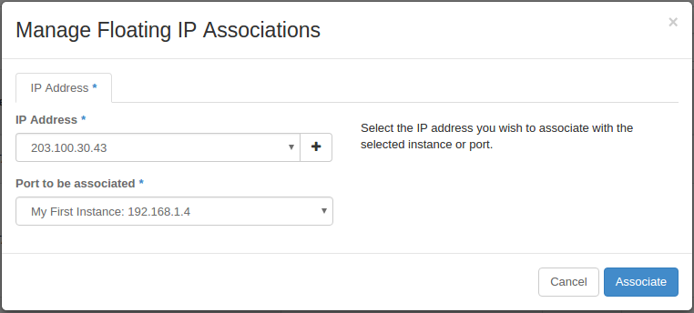

If you are using the OpenStack CLI, you can use the following commands to achieve identical results:

```bash
neutron floatingip-list #get a list of floating IP's allocated

+--------------------------------------+------------------+---------------------+--------------------------------------+
| id                                   | fixed_ip_address | floating_ip_address | port_id                              |
+--------------------------------------+------------------+---------------------+--------------------------------------+
| 796ae38f-d292-4c5a-93b1-24bb4bbf2955 |                  | 203.100.30.43       |                                      |
+--------------------------------------+------------------+---------------------+--------------------------------------+

nova interface-list cd576d51-8a13-49b9-9c13-88a0d57270f3 #get the port ID of the private network port so that we can attach the floating IP to that port

+------------+--------------------------------------+--------------------------------------+--------------+-------------------+
| Port State | Port ID                              | Net ID                               | IP addresses | MAC Addr          |
+------------+--------------------------------------+--------------------------------------+--------------+-------------------+
| DOWN       | b9b2ab60-d7b0-4dc2-a5fe-fb41e29f2545 | 09ff5a87-2d4a-4e57-a474-f2d2d688bb48 | 192.168.1.4  | fa:16:3e:1b:66:1d |
+------------+--------------------------------------+--------------------------------------+--------------+-------------------+

neutron floatingip-associate 796ae38f-d292-4c5a-93b1-24bb4bbf2955 b9b2ab60-d7b0-4dc2-a5fe-fb41e29f2545
Associated floating IP 796ae38f-d292-4c5a-93b1-24bb4bbf2955
```

Step 6c. Verify the floating IP is now present in the Dashboard (you may need to refresh the page) and try logging in to your instance: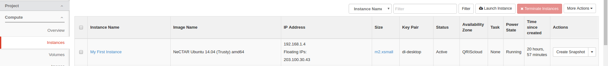


## Making changes

Duration: 5:00

### Attaching network interface/s to existing compute instance:

Step 1. From the Instance Actions menu click **Attach Interface**:

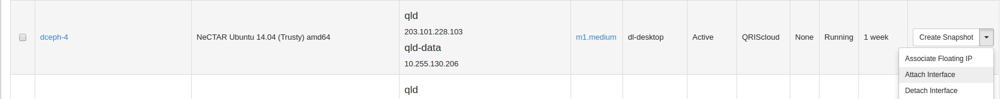

Step 2. Select the interface you want to attach from the dropdown list and click **Attach Interface**:

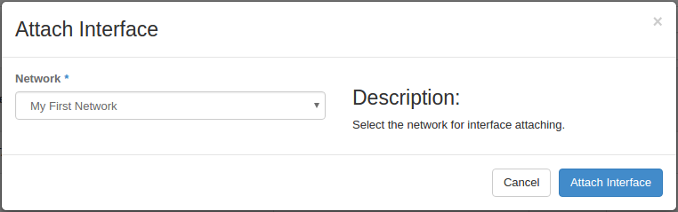

Please note that when you attach interfaces using the Dashboard, you are really attaching "Networks" which may come with 1 or more interfaces.   

If you use the OpenStack CLI, you can use the nova attach-interface command as follows:   

```bash
openstack network list #Find the network UUID which we want to attach to an instance

+--------------------------------------+-----------------------------------+----------------------------------------------------------------------------+
| ID                                   | Name                              | Subnets                                                                    |
+--------------------------------------+-----------------------------------+----------------------------------------------------------------------------+
| 00000000-0000-0000-0000-000000000000 | Classic Provider                  |                                                                            |
| 24dbaea8-c8ab-43dc-ba5c-0babc141c20e | tasmania                          | cf44c9ed-9e8b-47d8-bbc9-847801f1b3ca                                       |
| 058b38de-830a-46ab-9d95-7a614cb06f1b | QRIScloud                         | 24f7fa26-8f43-4b65-9bdf-91f99b5ae9fe                                       |
| e48bdd06-cc3e-46e1-b7ea-64af43c74ef8 | melbourne                         | b4771a97-bfb8-4e48-89af-10cf88e63a7f                                       |
| 00691b0f-69c3-444b-85ea-262dd6909052 | qld-data                          | 5783e74d-6e00-4815-a9c8-c0c54cdcf9fa                                       |
| 7b90b4df-5e64-4e50-8abd-1e1339f092fa | qh2-uom                           | 21a2e78b-483b-48a8-9bd9-770ea196acfd, d81ce7b8-c9d5-4385-b2bf-d620c59fe76f |
| 96d5e661-cdb6-4ecf-9a38-b0edda961fad | noblepark                         | fcd0ed12-d7c2-43d7-b9bd-556260072361                                       |
| e93c9d65-878a-4760-9111-c73f79115161 | queensberry                       | 25347767-e846-4e35-b60e-28931b5bdc7b, 9e354233-41b6-4437-98b1-5c4ab49d2a8a |
| 56c84852-e8b1-49f7-be67-bc0cfaec4188 | intersect-02                      | 67ab51f2-d046-42b1-9197-2b1d8ed2c5a7                                       |
| 9a284788-c0dd-4c5d-bc45-4425ad078737 | nci                               | b7e9dffe-6009-4e53-a550-5b2c19a2ac79                                       |
| e3573b3f-db78-4ab9-938f-542f7c94d0a0 | pawsey-01                         | 6af9d7da-6d48-4f6b-a255-0bd6d903ed6a                                       |
| 283e92a3-40dc-482f-bb94-9f4632c0190b | qld                               | 700efd32-2c0a-4292-a0d9-a83a1bb6fa52                                       |
| 915a3d96-693d-4c9d-a2ef-04996ab085d3 | monash-02                         | 2bdd914a-6e5f-4f34-ae19-f881be8be295                                       |
| 78dacb06-1162-454d-850c-78afd2033a38 | monash-03-internal                | 72b4520a-9e68-4b50-8e83-bb14f3443c63                                       |
| eb33feb8-027d-4d5d-8eab-69d3d6c08666 | intersect-01                      | 05341f20-ae8b-4670-9df7-171aada556db                                       |
| c9cbd99b-b6b3-49b9-b2b3-108dde0cdda6 | monash-01                         | 91bf744e-b79a-4bc5-8722-fe3569add0c0                                       |
| f0c86d08-d45b-45c4-9216-b8abd6bc133c | qh2-uom-internal                  | bc63c260-b2f6-4d57-ba03-f8fd89a35d8f                                       |
| 09ff5a87-2d4a-4e57-a474-f2d2d688bb48 | My First Network                  | 3b27e01c-d69d-4ae6-be9e-c3b61ce93b93                                       |
| 8c6b8b1f-2610-4b26-9b27-cd6db8aca397 | tas                               | 9df63d68-7a3e-4ef8-9d6b-67ae4b74c509                                       |
| 71a08d91-ea37-4e2a-834e-0b158f08a351 | tas-s                             | dc38a998-57f9-49c0-8ee3-2681afedfbd2                                       |
| bda5ae9f-e56c-43b5-a327-a81672247436 | as-tn                             | 24b0228b-341d-4ece-8450-183627affb8e                                       |
| b2719045-2cd1-4290-9ca8-9055b9df9df4 | sa-citywest                       | 03292ee8-0ae4-4d18-9c8c-708c9ecdeb09                                       |
| cba46835-45b7-43c0-a616-365302c3a634 | asm-priv-test                     | 284f4ea3-c4e9-4951-8cf1-8651a3fdc8aa                                       |
| 4d0fbec6-f9a4-4d39-9225-082716c64008 | monash-03-public                  | 8bb4e24c-538d-4604-9128-b7aab6afaaa7                                       |
+--------------------------------------+-----------------------------------+----------------------------------------------------------------------------+

openstack server list #find the UUID of the instance

+--------------------------------------+---------------------------------------------------+-----------+--------------------------------------------------------------------+
| ID                                   | Name                                              | Status    | Networks                                                           |
+--------------------------------------+---------------------------------------------------+-----------+--------------------------------------------------------------------+
| cd576d51-8a13-49b9-9c13-88a0d57270f3 | My First Instance                                 | ACTIVE    | My First Network=192.168.1.7                                       |
+--------------------------------------+---------------------------------------------------+-----------+--------------------------------------------------------------------+

nova interface-attach --net-id=09ff5a87-2d4a-4e57-a474-f2d2d688bb48 cd576d51-8a13-49b9-9c13-88a0d57270f3 #attach My First Network to My First Instance
```


### Detaching network interface from instance:

Step 1. From the Instance Actions menu click **Detach** **Interface**:

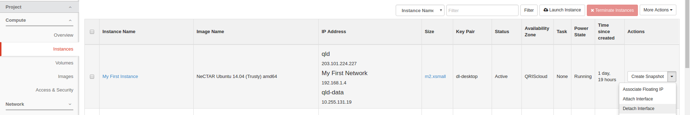

Step 2. Select the interface you want to detach from the dropdown list and click **Detach** **Interface**:

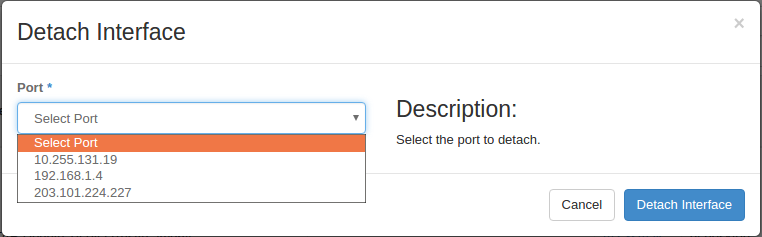

Please note that when you attach interfaces using the Dashboard, you are really attaching "Networks" which may come with 1 or more interfaces. Detaching interfaces allows actual removing of unwanted interfaces. Ie if you add the "Classic Provider" network in QRIScloud Availability Zone, you will get two interfaces: qld and qld-data. You are able to detach one interface, and keep the other.

If you use the OpenStack CLI, you can achieve identical results by using the following commands:

**find UUID of the port (interface) "My First Network"**

```bash
$ nova interface-list cd576d51-8a13-49b9-9c13-88a0d57270f3

+------------+--------------------------------------+--------------------------------------+-----------------+-------------------+
| Port State | Port ID                              | Net ID                               | IP addresses    | MAC Addr          |
+------------+--------------------------------------+--------------------------------------+-----------------+-------------------+
| DOWN       | 27a09953-ab35-4fdf-b02d-9ac8f80f50f5 | 283e92a3-40dc-482f-bb94-9f4632c0190b | 203.101.224.228 | fa:16:3e:04:96:f2 |
| DOWN       | cfcc9430-1652-4c97-bf92-2e312138d646 | 00691b0f-69c3-444b-85ea-262dd6909052 | 10.255.131.192  | fa:16:3e:6b:af:55 |
| DOWN       | d8c0c3df-259c-480d-a995-8d27dbff9a42 | 09ff5a87-2d4a-4e57-a474-f2d2d688bb48 | 192.168.1.7     | fa:16:3e:21:5c:d2 |
+------------+--------------------------------------+--------------------------------------+-----------------+-------------------+
```
**detach "My First Network" port (interface) from instance "My First Instance"**
```bash
nova interface-detach cd576d51-8a13-49b9-9c13-88a0d57270f3 d8c0c3df-259c-480d-a995-8d27dbff9a42
```

### Disassociating a Floating IP from instance:

Step 1. From the Instance Actions menu click **Disassociate Floating IP**:

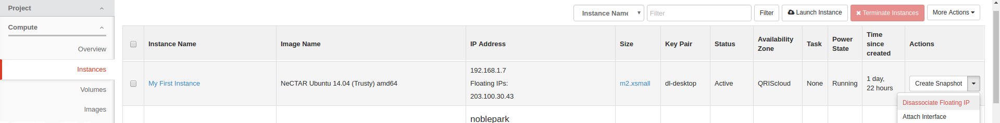

Step 2. Click **Disassociate Floating IP** to confirm

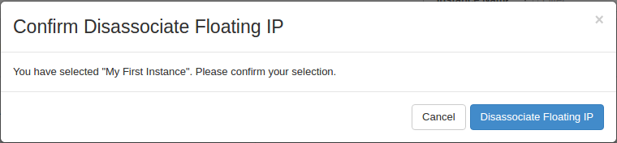

If you are using the OpenStack CLI, you can use the following commands to achieve identical results:

**get the UUID of the floating IP**

```bash
$ neutron floatingip-list

+--------------------------------------+------------------+---------------------+--------------------------------------+
| id                                   | fixed_ip_address | floating_ip_address | port_id                              |
+--------------------------------------+------------------+---------------------+--------------------------------------+
| 796ae38f-d292-4c5a-93b1-24bb4bbf2955 | 192.168.1.7      | 203.100.30.43       | b9b2ab60-d7b0-4dc2-a5fe-fb41e29f2545 |
+--------------------------------------+------------------+---------------------+--------------------------------------+


```
**remove floating IP from instance**

```bash
$ neutron floatingip-disassociate 796ae38f-d292-4c5a-93b1-24bb4bbf2955
Disassociated floating IP 796ae38f-d292-4c5a-93b1-24bb4bbf2955

```


## FAQ

Duration: 5:00


**Q: I want a private network for my instances to communicate with each other but I want to use classic networking for outside communication. How do I do that?**

A: When creating the subnet, ensure you disable the gateway otherwise you will have two default routes in your instance and you may not be able to communicate with it. When launching an instance, add both Classic Provider and your private network to the list.


**Q: I have a private network with more than one subnet. How do I connect my instance to more than one subnet from the same network? Only the first subnet is connected.**

A: When launching an instance, OpenStack will only connect your first subnet of your private network to your instance. To connect more subnets, please create a port for the additional subnets (Network -> Networks -> {Your Private Network} -> Ports -> Create Port) by selecting "Subnet" under "Specify IP address or subnet" and selecting your additional subnet under "Subnet". All other fields can be left blank. After this, you can attach this subnet to your instance (Compute -> Instances -> Attach Interface) by selecting "by Port" under" The way to specify an interface" and selecting your newly created port.


**Q: I want a private network for my instances to communicate with each other but I also want to be able to communicate with RDS storage from my instance in Queensland. How do I do that?**

A: You can launch an instance with the private network only, wait for instance to boot then from the Dashboard attach the Classic Provider interface (Instance Actions -> Attach Interface -> ...), then detach the public port from the instance (Instance Actions -> Detach Interface -> 203.101.xxx.xxx). Inside the instance, configure the second interface to use DHCP and reboot your instance. You should then have your private network alongside the qld-data network. You can also add the qld-data network by using the following command:

```
nova interface-attach --net-id=00691b0f-69c3-444b-85ea-262dd6909052 <instance_id>
```


**Q: How do I create multiple networks that communicate with each other?**

A: There are two ways to approach this: a) one network, multiple subnets within one network or b) multiple networks, one subnet per each network. Option b) is recommended because option a) does not allow the user to use the Dashboard to attach a second subnet to an instance, only the first. Option b) involves creating multiple networks, one subnet for every network, a virtual router, then attaching every subnet to the router. The virtual router will automatically route between the subnets attached to it. When creating instances / attaching networks to existing instances, you can select the network which contains the desired subnet from the list (which is not an available function if using option a)). If you are using option b) and you need to attach a second subnet to an instance, you can do so using the following commands:

- create a port on the desired subnet

```bash
$ neutron port-create --fixed-ip subnet_id=<subnet_id> <network_id>
```
- attach the port to instance

```bash
$ nova interface-attach --port-id <port_id> <instance_id>
```

- or create a new instance with it

```bash
$ openstack server create \
   --flavor <flavor> \
   --image <image> \
   --key-name <key> \
   --security-group ssh_icmp_http_https \
   --availability-zone QRIScloud \
   --nic port-id=<port_id>
   <instance_name>
```


**Q: Can I associate a floating IP from Availability Zone "A" to an instance in Availability Zone "B"?**

A: Yes! As long as the external network of your router belongs to the same Availability Zone as the Floating IP, the instance that is connected to this router via a network can have the Floating IP associated with it. Otherwise, you will get an error.


## Next steps

Duration: 1:00

Some Nectar Openstack technologies rely on private networking. Learn about Load Balancing as a Service (LBAAS) [here](https://support.ehelp.edu.au/support/solutions/articles/6000192785)
