---

id: launching-virtual-machines
summary: Launching a virtual machine using the Nectar Dashboard and the launching dialog
categories: nectar
tags: dashboard, launching
difficulty: 2
status: draft
feedback_url: https://github.com/JustBerkhout/tutorials.ubuntu.com/issues
published: 2013-05-14
author: Just Berkhout <just.berkhout@utas.edu.au>

---

# Launching Virtual Machines

## Overview

Duration: 3:00

### What is Launching

In Nectar you can create your own Virtual Machines. We call it *Launching*.  From your Nectar dashboard it is easy to start the launch dialog, and from there it is straightforward to create a basic Virtual Machine.

In this tutorial you'll step through the launch dialog to configure the options for creating your Virtual Machine. And just in case you're wondering: yes we use the word _Instance_ a lot: in Nectar it is synonymous with *Virtual Machine*.

positive
: **Cloud Starter**
This tutorial is part of the Nectar Cloud Starter curriculum. You should be familiar with the absolute basics of Security Groups, you should have a Keypair and you should have terminal software installed on your machine. If you  think you need help with any of that, you should complete Cloud Starter tutorials before  you start here.

### What you'll learn

- Launch a Virtual Machine in your Nectar Porject

### What you'll need

- Security Group to allow `ssh`
- Keypair
- [Terminal software](https://support.ehelp.edu.au/support/solutions/articles/6000223964-terminal-software)
- Access to a Nectar Project

## Starting the Launch Dialog

Duration: 3:00

In this tutorial we will use the Launch Dialog and configure the most basic Virtual Machine we could think of.

- Log on to on your [Nectar Dashboard](https://dashboard.rc.nectar.org.au) and ensure you're working in the right project (Use the project selector on the top left-hand side)
- Navigate to the `Project | Compute | Instances` page
- Click the `Launch Instance` button to start the Launch Dialog

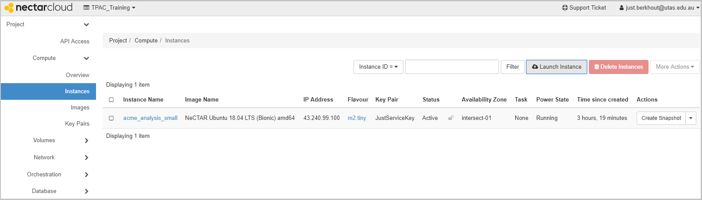

### From the Images page

- Alternatively you can navigate to the `Project | Compute | Images` page, find an Image, and Click *Launch* on the Image’s Action Menu Button

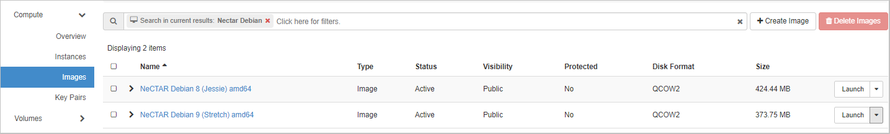

The `Launch Dialog` will guide you through the steps to launch an instance.

## Details, Source and Flavor

Duration: 5:00

### Details

Your instance must have a **name**; a **description** is optional. In certain circumstances you deliberately choose the **Availability Zone**, but you can also let Nectar decide by choosing *Any Availability Zone*. You can launch multiple instances at a time by setting the **Count**

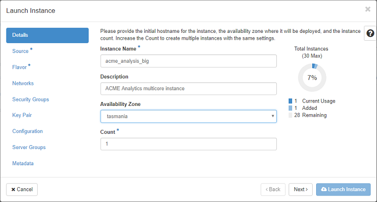

### Source

Choose a **Boot Source** (most common is *Image*)

Use the Filter widget to help you find the image you need; Use the up-arrow beside the image you need to select it for launch

If you started the Launch dialog from the *Images* page, instead of the *Instances* page, the Source tab is already configured right. If you need to, you can make changes though.

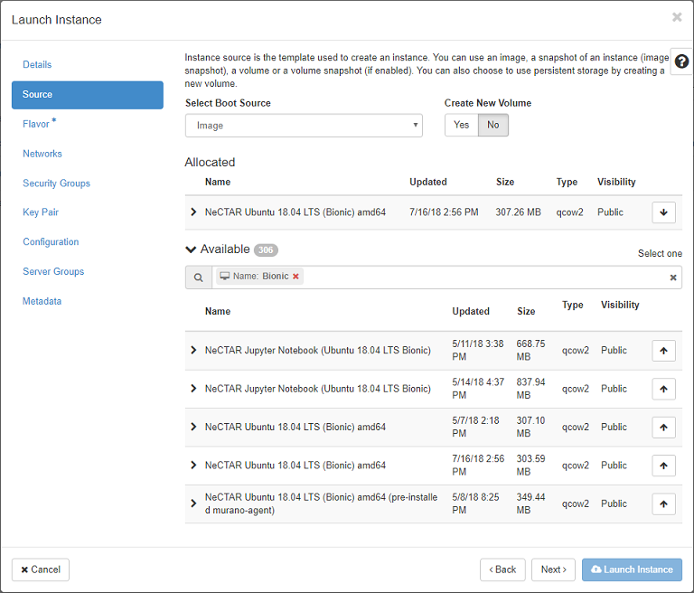

### Filters

A quick word on Filters: Throughout the Nectar Dashboard you’ll find filters to help you find images, flavors, security groups, networks etc. You can type free text in to them, or build specific filters as shown in the example here

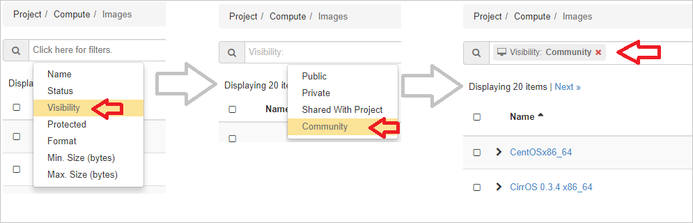

### Flavor

Use the Filter widget to help you find the Flavor you need

Use the up-arrow beside the flavor you need to select it for launch

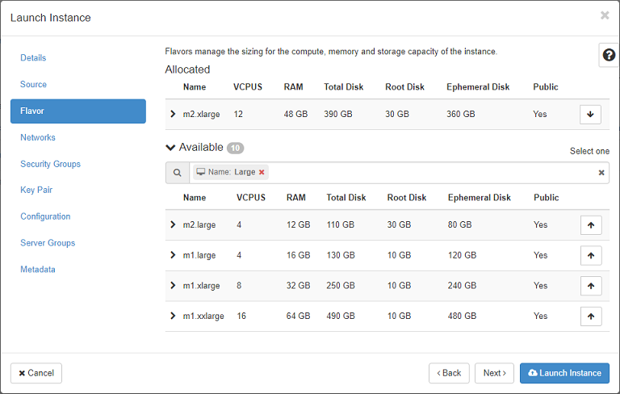

## Networks, Security Groups and Key Pair

Duration: 4:00

### Networks

Basic usage: choose *Classic Provider*

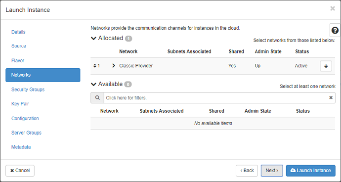

You can learn more about making your own private networks and other networking topics in our Advanced Networking

### Security Groups

Use the up-arrow to select the `ssh` security group.

positive
: If you're following the Cloud Starter Curriculum, you created this in the tutorial *Security groups, the absolute basics*

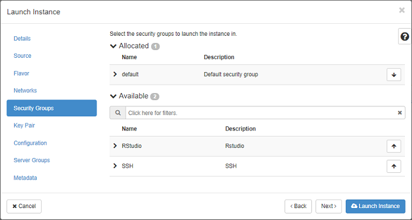

### Key Pair

Use the up-arrow to select your public key.

positive
: If you're following the Cloud Starter Curriculum, you created this in the tutorial *Creating a keypair for use in Nectar*

negative
: For connecting to your instance using SSH you will need to have selected a key pair.

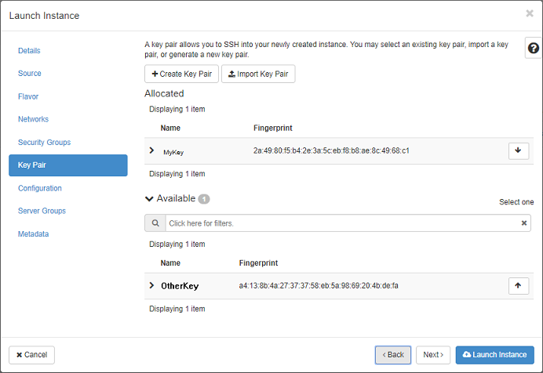

### Optional tabs

the tabs **Configuration**, **Server Groups** and **Metadata** are optional and are not part of this tutorial

### Launch

Your are now ready to Launch your instance.

- Click the Launch Instance button

## Launch Instance

Duration: 5:00

Your instance will now be built according to the configuration options that you have specified in the configuration steps above. The **Instances** page will list your instance' details, along with some status information

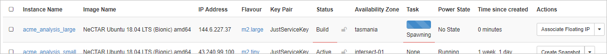

Once the Status becomes **Active** your instance is ready.

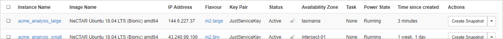

You have now successfully launched a Virtual Machine using the Nectar Research Cloud dashboard.

High five!

## Next Steps

positive
: **Cloud Starter**
Congratulations. You've completed a Launch. Your first? Now what?

Our next tutorial will show you how to connect to your instance using `ssh` and terminal software.
